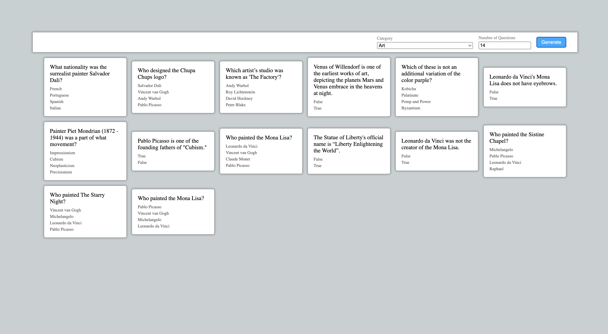

# Flashcard Generator Application

This application allows you to generate questions in different categories and create flashcards. Questions are fetched from the Open Trivia Database (OpenTDB) API.

To clone the repository run:
```
git clone https://github.com/HilalKocak/flash-card-quiz.git
```

Install dependencies:
```
npm install
npm i axios
```

To run the application:
```
npm run dev
```

Here is the preview of the application:
